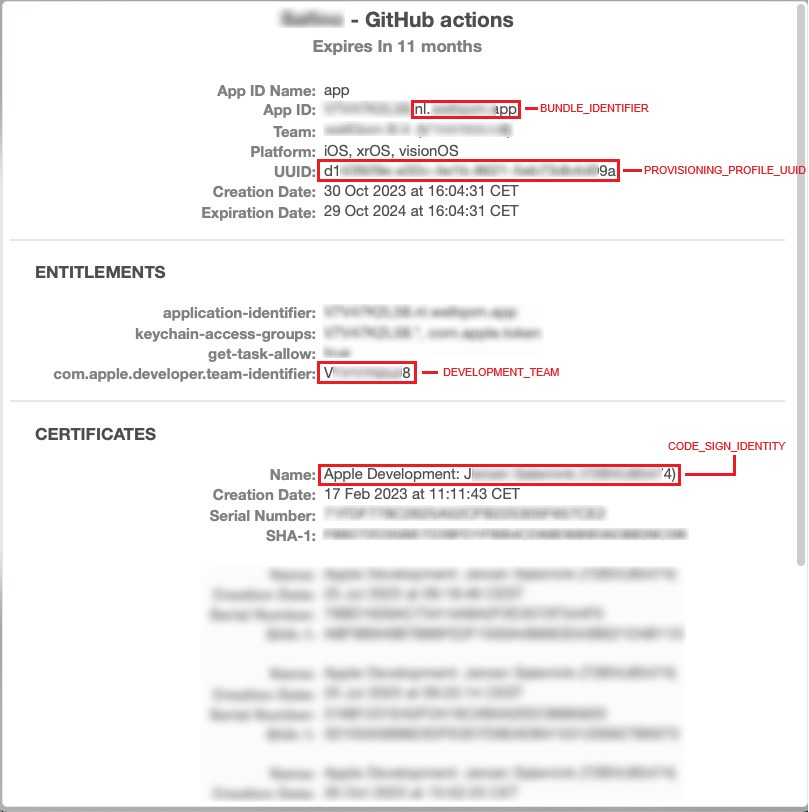

# Build and distribute iOS app to Firebase CD
- - - -

The iOS app deployment pipeline requires several configuration steps before it can be used. First, you need to create a certificate and provisioning profile. After that, you'll need to set a couple of GitHub secrets. Finally, some modifications are required for the Podfile. This manual will guide you through the complete setup process, step by step.


## 1. Create a certificate

  **Note:** A certificate can be used to sign multiple different apps. If you have already created a certificate before, you can skip this step and reuse the certificate you already own.

  Before you can create a certificate, follow the steps to [generate a certificate signing request (CSR)](https://developer.apple.com/help/account/create-certificates/create-a-certificate-signing-request). Then, proceed with the steps below.

  1. Login to [Apple Developer](https://developer.apple.com), and go to the "Account" section. From there, navigate to "Certificates."
  2. Click on the :heavy_plus_sign: icon to create a new certificate.
  3. Choose "Apple Development," and then click on "Continue."
  4. Pick your CSR file from your Mac, and proceed by clicking "Continue."
  5. Download the generated certificate.
  6. Open Keychain Access from the Launchpad.
  7. On the left side, select the keychain that was originally used for creating the CSR file.
  8. Go to "File" → "Import Items..." and choose the certificate you downloaded just now.
  9. Right-click on the imported certificate, and choose "Export Apple Development..." from the menu.
  10.  Choose an appropriate filename and a location for storing the certificate. For the file format, select "Personal Information Exchange (.p12)." If this file format is not available, you may have selected the wrong keychain in step 7.
  11.  For security reasons, it is recommended to set a password for the certificate.


## 2. Create a provisioning profile
Before creating a provisioning profile, it's essential to have created a certificate. Without a certificate, creating a provisioning profile is not possible.

  1.  Login to [Apple Developer](https://developer.apple.com), and go to the "Account" section. From there, navigate to "Profiles."
  2.  Click on the :heavy_plus_sign: icon to create a new profile.
  3.  Choose "iOS App Development," and then click "Continue."
  4.  Select the ID of the app for which you want to create a profile, and then click "Continue." If you're unsure about the ID, you can find it by opening your app in Xcode and locating the bundle identifier.
  5.  Select the certificate you just created and click continue. It can be hard to identify the certificate, it's no problem if you select the wrong certificate at first. You can easily change the certificate after the profile has been created.
  6.  Choose all the devices on which you want to test the app and then click "Continue."
  7.  Choose a suitable name for the provisioning profile, and then click "Generate."
  8.  Download the provisioning profile.


## 3. Verify the certificate and provisioning profile
It's crucial to verify that the certificate and provisioning profile are properly associated. If they are not, the app signing process will fail, resulting in a pipeline failure.

### 3.1 Locate the certificates fingerpint

  1. Open your keychain and locate the certificate you have created.
  2. Double-click on the certificate to open its details.
  3. Scroll all the way to the bottom to find the SHA-1 fingerprint. 
   

### 3.2 Locate the fingerprint in the provisioning profile
   1. Locate your downloaded provisioning profile in Finder and open it by pressing the space bar. 
   2. Scroll to the certificates section and try and find the certificates fingerprint in the provisioning profile. 
   
   
   If you found the fingerprint in the provisioning profile, it indicates that they are correctly coupled. If you can't find it, it means you selected the wrong certificate in step 2.5. To rectify this, go back to profiles in [Apple Developer](https://developer.apple.com), locate the profile, click "Edit," select a different certificate, and save. Then, attempt to verify that the certificate and provisioning profile are now properly coupled.


## 4. Add GitHub secrets and variables
The pipeline requires the following secrets and variables:

Name | Type | Required
-----|------|---------
BUNDLE_IDENTIFIER | secret | true
CERTIFICATE_BASE64 | secret | true
CERTIFICATE_PASSWORD | secret | false
CODE_SIGN_IDENTITY | secret | true
DEVELOPMENT_TEAM | secret | true
DOTENV_BASE64 | secret | false
FIREBASE_SERVICE_ACCOUNT | secret | true
IOS_APP | variable | true
PROVISIONING_PROFILE_BASE64 | secret | true
PROVISIONING_PROFILE_UUID | secret | true

The value of the secret CERTIFICATE_PASSWORD is the password you added to the certificate in step 1.11. If you chose not to add the password, you can skip this secret.

### 3.1 Extract secret values from provisioning profile
You can extract the following values for the secrets from the provisioning profile:
- BUNDLE_IDENTIFIER
- PROVISIONING_PROFILE_UUID
- DEVELOPMENT_TEAM
- CODE_SIGN_IDENTITY
  
Navigate to your provisioning profile in Finder and open it by pressing the space bar. See the image below where you can find these values. If there are multiple certificates, as shown in the image below, ensure you obtain the CODE_SIGN_IDENTITY from the certificate that has the same fingerprint as the one you found in step 3.1.



### 3.2 Generate the base64 secrets
To generate the secrets CERTIFICATE_BASE64, PROVISIONING_PROFILE_BASE64, and DOTENV_BASE64 from the terminal, you will need the certificate and provisioning profile you created earlier. The use of DOTENV is optional and is only required when your project uses a dotenv file.

1. Open the terminal and cd to the directory where the certificate, provisioning profile, or dotenv file is located.
2. Execute the command "base64 -i file.xx" in the terminal, replacing "file.xx" with the name of the provisioning profile, certificate, or dotenv file. This command will provide the string value that should be added as the GitHub secret.


### 3.3 Get the IOS_APP variable
 1. Open your project in the [Firebase Console](https://console.firebase.google.com).
 2. Navigate to Project Settings and scroll down until you reach the "Your Apps" section.
 3. Click on the iOS app you're working with.
 4. Locate the App ID, which corresponds to the value of the IOS_APP variable.
   

### 3.4 Firebase service account
TBD


### 3.5 Add the secrets to github
 1. Open the repository in github.
 2. Navigate to Settings → Secrets and variables → Actions.
 3. Depending on whether you're adding a secret or a variable, click "New Repository Secret" or first select "Variables" and then "New Repository Variable."
 4. Enter the secret/variable name exactly as specified in the table above.
 5. Provide the secret/variable value, and then click "Add Secret" or "Add Variable."


## 4. Modify Podfile
 To ensure that the pipeline doesn't attempt to sign the installed Pods, you'll need to add specific code to your Podfile. This is necessary because, by default, the pipeline signs the app manually, which can cause issues with certain Pods that do not allow signing.

 ```Ruby
post_install do |installer|
  installer.pods_project.targets.each do |target|
    target.build_configurations.each do |config|
      config.build_settings['EXPANDED_CODE_SIGN_IDENTITY'] = ''
      config.build_settings['CODE_SIGNING_REQUIRED'] = 'NO'
      config.build_settings['CODE_SIGNING_ALLOWED'] = 'NO'
    end
  end
end
```

If the post_install already exists in the Podfile, make sure you merge the two functions together to not break the existing code. If the function doesn't exist yet, add it to the end of the Podfile.

## 5. Add the workflow to the repository
If you've followed the first four steps, your repository is now correctly configured. 

1. Copy the [app-firebase-cd.yml](../../../workflow-templates/app-firebase-cd.yml) template and add it to your GitHub workflows folder.
2. In this file, locate the "call-global-iconica-build-ios-workflow" job.
3. Set the 'subfolder' variable if your app workflow doesn't run from the root of your repository. If it does, you can omit the variable.
4. If you've named the secrets differently from FIREBASE_SERVICE_ACCOUNT or DOTENV_BASE64, you can provide their actual names using the variables "gcp_sa_kay_override" and "dotenv_override," respectively. If you didn't, you can simply omit these variables.


## 6. Run the workflow
To execute the workflow, ensure that it is pushed to the default branch, and then follow these steps:

   1.  Open GitHub and go to the "Actions" tab.
   2.  From the sidebar on the left side of the screen, choose the action.
   3.  Click on "Run Workflow."
   4.  Optionally, enter the name of a tester group. You can leave the field empty if you prefer.
   5.  Select "Build & Release for iOS."
   6.  Click "Run workflow".


